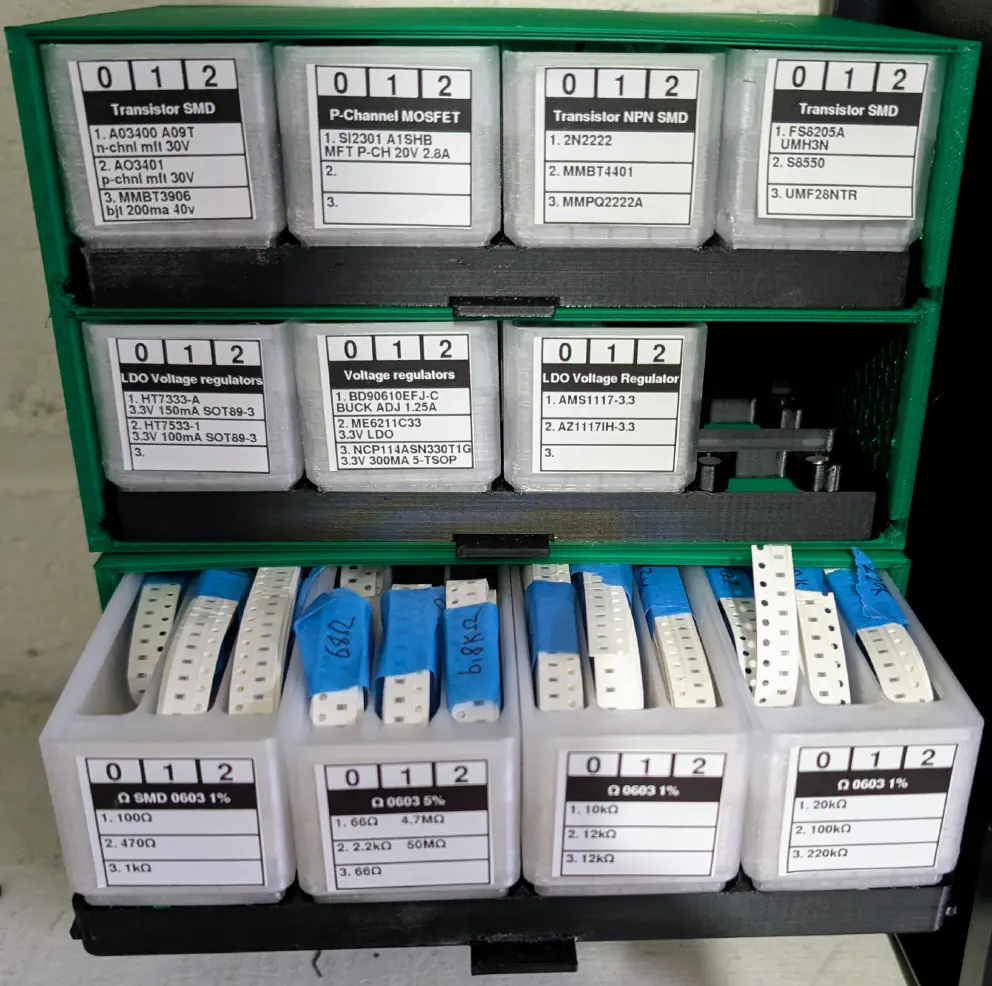

# SMD-Gridfinity

This is a collection of [OpenSCAD](https://openscad.org/) designs for storage of SMT components
for hobbyist/home assembly of PCBAs.  These are designed to work with Gridfinity, using the
[Gridfinity Rebuilt](https://github.com/kennetek/gridfinity-rebuilt-openscad) project.

## SMD pick-bins

[Bins/](Bins) is a set of SMD pick-bins.

[Cabinet/](Cabinet) has a shelf that the pick-bins can be placed on, and a storage cabinet that these shelves can be placed into for storage.

## SMT component bulk storage

[Bulk/](Bulk) has a set of Gridfinity bins for bulk storage of SMD components (e.g., tapes of components), as well as a shelf and cabinet design for storage of these bins.

## Cheap "sample books"

[Book/](Book) has an extremely simple design for making an SMD component "book" from a set of SMD sample pages.

